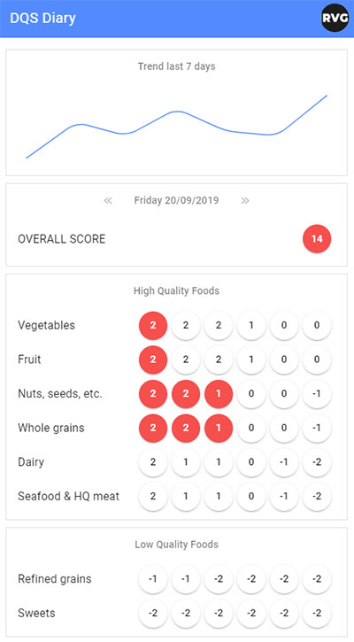
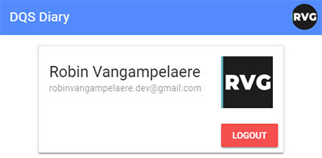

# DQS Diary

DQS Diary is a small app I wrote to fresh up my Vue and Firebase skills. The app lets you log in with Google authentication and records your daily diet quality. DQS Diary also contains an overview of the last 7 days. Everything is dynamic and is updated realtime from a Firestore instance.

---

## Tools

Tools I used for the project

- <a href="https://vuejs.org/" target="_blank">`Vue`</a>
- <a href="https://vuex.vuejs.org/" target="_blank">`Vuex`</a>
- <a href="https://vuematerial.io/" target="_blank">`Vue Material`</a>
- <a href="https://firebase.google.com/products/auth/" target="_blank">`Firebase Authentication`</a>
- <a href="https://firebase.google.com/products/firestore/" target="_blank">`Firebase Firestore`</a>

---

## Credits

Thanks to Matt Fitzgerald, creator of the Diet Quality Score

- Website at <a href="http://8020endurance.com/" target="_blank">`8020endurance.com`</a>
- Twitter at <a href="https://twitter.com/mattfitwriter" target="_blank">`@mattfitwriter`</a>

---

## Contact

Reach out to me

- Website at <a href="https://robinvangampelaere.com/" target="_blank">`robinvangampelaere.com`</a>
- LinkedIn at <a href="https://www.linkedin.com/in/robinvangampelaere/" target="_blank">`linkedin.com/in/robinvangampelaere/`</a>
